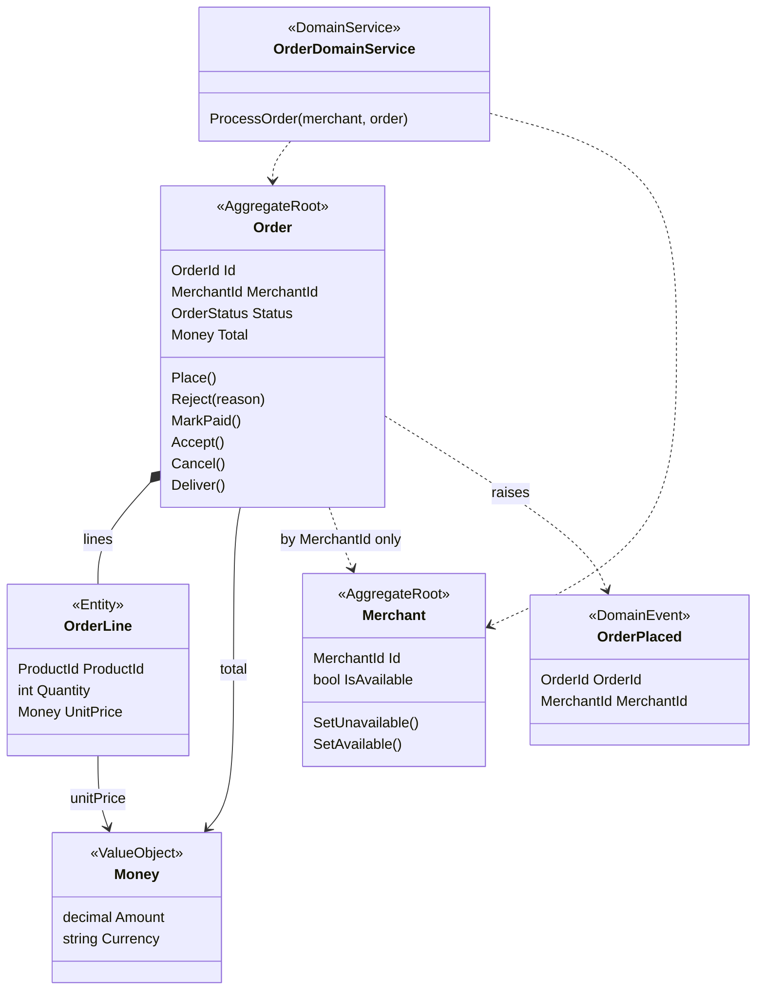

# Order context overview

Stereotypes name the building block. Aggregates refer to each other by id only, so the Order to Merchant link is dashed.

```mermaid
classDiagram
    class Order {
        <<AggregateRoot>>
        OrderId Id
        MerchantId MerchantId
        OrderStatus Status
        Money Total
        Place()
        Reject(reason)
        MarkPaid()
        Accept()
        Cancel()
        Deliver()
    }
    class OrderLine {
        <<Entity>>
        ProductId ProductId
        int Quantity
        Money UnitPrice
    }
    class Money {
        <<ValueObject>>
        decimal Amount
        string Currency
    }
    class Merchant {
        <<AggregateRoot>>
        MerchantId Id
        bool IsAvailable
        SetUnavailable()
        SetAvailable()
    }
    class OrderDomainService {
        <<DomainService>>
        ProcessOrder(merchant, order)
    }
    class OrderPlaced {
        <<DomainEvent>>
        OrderId OrderId
        MerchantId MerchantId
    }
    Order *-- OrderLine : lines
    Order --> Money : total
    OrderLine --> Money : unitPrice
    Order ..> Merchant : by MerchantId only
    OrderDomainService ..> Order
    OrderDomainService ..> Merchant
    Order ..> OrderPlaced : raises
```

Ledger: ord-0017
