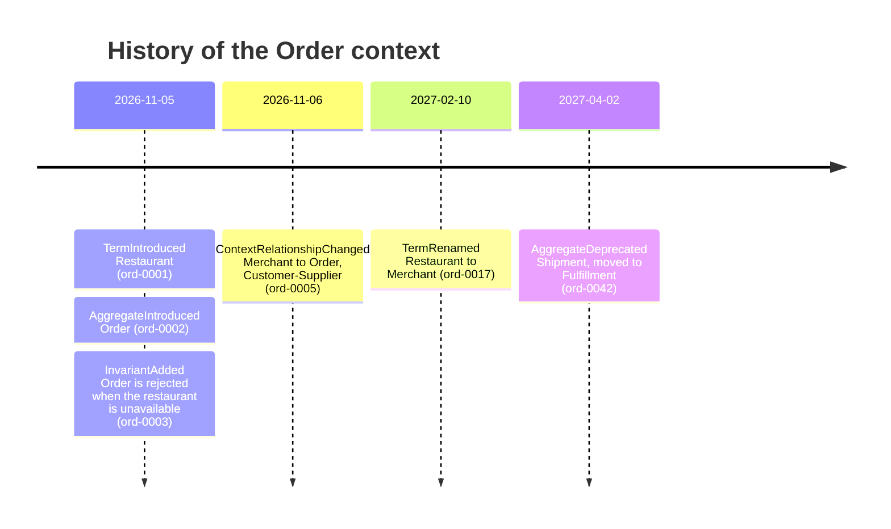

# History of the Order context

Generated from `Order.Domain/DOMAIN-HISTORY.jsonl` on request. Not stored in a real repo; this file exists only as a sample. The id in brackets is the ledger line.

```mermaid
timeline
    title History of the Order context
    2026-11-05 : TermIntroduced Restaurant (ord-0001)
               : AggregateIntroduced Order (ord-0002)
               : InvariantAdded Order is rejected when the restaurant is unavailable (ord-0003)
    2026-11-06 : ContextRelationshipChanged Merchant to Order, Customer-Supplier (ord-0005)
    2027-02-10 : TermRenamed Restaurant to Merchant (ord-0017)
    2027-04-02 : AggregateDeprecated Shipment, moved to Fulfillment (ord-0042)
```
